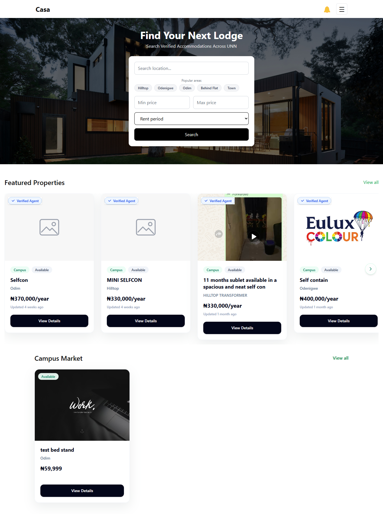
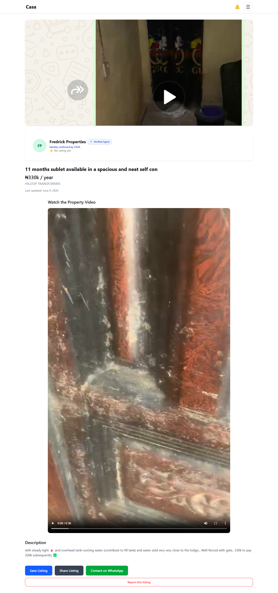
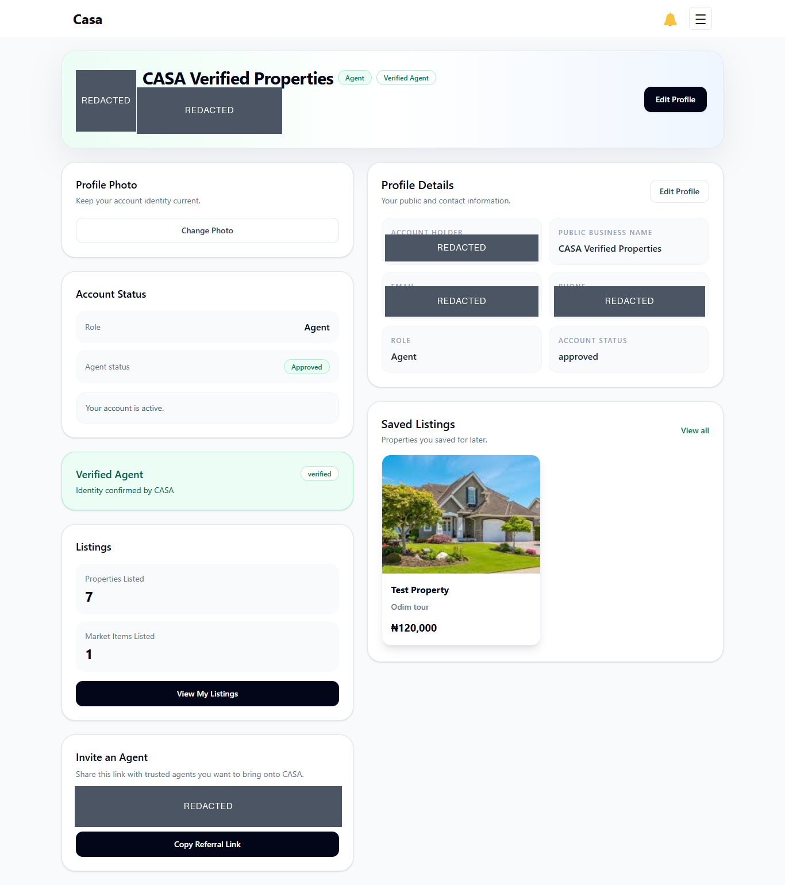
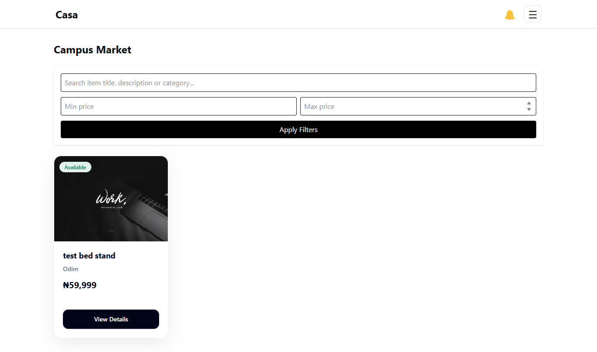
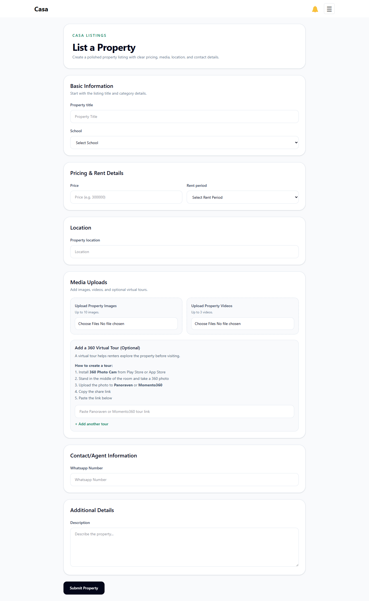
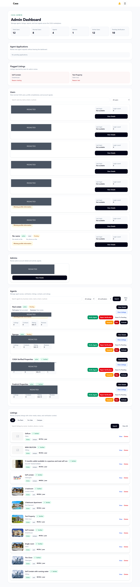

# CASA

**A trusted Nigerian housing and local marketplace platform, beginning with student accommodation around UNN.**

## Overview

CASA helps people find accommodation with clearer information and stronger trust signals than informal, fragmented property search. People can browse structured property listings, compare key details, review the agent behind a listing, save properties, report concerns, and contact agents directly by phone or WhatsApp.

The product also includes Campus Market, a local marketplace where students can discover useful items and connect with sellers. Approved agents receive tools for managing listings and marketplace posts, while administrators oversee agent onboarding, verification, users, listings, and reports.

CASA's long-term purpose is broader than student housing. It is being built as a trusted Nigerian housing and local marketplace platform for renters, buyers, landlords, agents, students, and everyday Nigerians searching for accommodation or property.

## The Problem

Housing discovery in Nigeria often depends on word of mouth, informal middlemen, and scattered posts across different channels. This creates recurring problems:

- Prices and availability may be unclear.
- Comparing several options takes unnecessary time and effort.
- Property information is fragmented and inconsistently presented.
- Searchers may not know whether an agent is credible.
- Scam concerns make direct contact feel risky.
- Multiple informal middlemen can make the process harder to understand.
- Students may need to find accommodation quickly while also managing school deadlines and limited local knowledge.

CASA addresses these practical problems without relying on unsupported claims or statistics.

## The Solution

CASA brings the property-search journey into one structured experience through:

- Searchable property listings and price filters.
- Consistent property information, images, videos, and supported virtual-tour links.
- Public agent profiles with business names, approval context, verification status, ratings, and reviews.
- Saved listings for signed-in property seekers.
- Listing reports for suspicious or concerning properties.
- Direct phone and WhatsApp contact.
- Referral-controlled agent applications.
- Administrative review, verification, and moderation tools.
- Campus Market for local student commerce.

## Vision and MVP Strategy

### Wider Nigerian vision

CASA is intended to grow into a trusted housing and local marketplace platform for the wider Nigerian market. Its future audience includes renters, buyers, landlords, property agents, students, and other people trying to find or offer accommodation and property with less confusion.

### Current UNN student-first MVP

The current MVP focuses on student accommodation around the University of Nigeria, Nsukka (UNN). Property creation currently treats listings as **Campus Stay** listings.

This is a deliberate validation strategy:

- Begin with one high-need demographic.
- Solve the problem deeply within one location.
- Validate how property seekers browse, compare, save, and contact.
- Validate trusted-agent recruitment and onboarding.
- Learn from a focused market before expanding into wider Nigerian rental and property-sale categories.

CASA is therefore student-first today, but it is not permanently limited to students.

## Build Week Track

**Apps for Your Life**

CASA fits this consumer-application track because housing discovery is an everyday, high-stakes need. The product helps people make practical decisions about where to live, assess who they are dealing with, communicate directly, and participate in a useful local marketplace from a mobile-first interface.

## Current Features

### Property Seekers

- Browse active properties from the homepage, campus page, property catalogue, and search results.
- Filter by location, price, and rent period.
- Open property details with images, optional videos, and supported virtual-tour links.
- Review price, location, availability, listing freshness, agent details, ratings, and reviews.
- View public agent profiles and the agent's active properties and marketplace items.
- Save and remove listings after signing in.
- Contact agents by phone or WhatsApp through a safety-confirmation flow.
- Report suspicious listings with a reason.
- Rate or review an agent after a recorded contact.

### Agents

- Apply through a referral link belonging to a currently approved agent.
- Create Campus Stay property listings after approval.
- Edit only properties they own or represent.
- Upload property images, videos, and supported virtual-tour links.
- Activate, deactivate, and renew property listings from the dashboard.
- Post and manage Campus Market items after approval.
- Maintain public profile and business information.
- Receive ratings and reviews from contacted users.
- Generate and share a referral link after approval.

### Administrators

- Review agent applications and approve or reject them.
- Manage agent verification separately from agent approval.
- Search and inspect users, agents, and listings.
- Review account status, listing totals, contact activity, ratings, saved listings, and referral relationships.
- Review user-reported listings.
- Remove listings through the moderation interface after confirmed database deletion.

CASA does **not** currently require every property to receive admin approval before it can appear publicly. Administration focuses on agent access, verification, reports, user management, and listing moderation.

### Campus Market

- Browse active marketplace items.
- Search by item title or description and filter by price.
- View item details, seller information, verification context, and ratings.
- Contact sellers through WhatsApp.
- Allow approved agents to create, edit, activate, and deactivate their marketplace items.

### Trust and Safety

- Separate agent approval status from verification status.
- Use current approved-agent status as the access requirement for property and marketplace posting.
- Display verification badges where relevant.
- Restrict property editing by authentication, approval, and ownership or representation.
- Use referral-only agent applications as an early quality-control layer.
- Allow signed-in users to report listings.
- Restrict review submission to users with a recorded contact.
- Provide admin moderation for reports, users, agents, and listings.

## How CASA Was Built With Codex

The founder is a non-technical founder and digital marketer, not a professional software developer. The founder defined the problem, desired user experience, feature requirements, priorities, acceptance criteria, business decisions, and testing feedback.

Codex performed the software implementation. It inspected the repository, wrote code, implemented features, debugged failures, refactored components, traced Supabase data flows, and ran linting and production builds. The entire software implementation was completed through Codex-directed development.

The development loop was:

1. The founder explains the desired outcome in plain English.
2. Codex inspects the relevant repository code.
3. Codex implements a focused, scoped change.
4. The founder tests the result.
5. The founder provides screenshots and behavioural feedback.
6. Codex diagnoses the problem and improves the implementation.
7. Linting and production builds validate the changes.

The founder remained responsible for product direction, priorities, user experience, testing, business decisions, and approval of each outcome. Codex handled the technical translation and implementation.

## How GPT-5.6 Contributed

CASA began before GPT-5.6 was available. GPT-5.6 was introduced later and used extensively for codebase review, debugging, architecture reasoning, Supabase relationship analysis, feature refinement, and final Build Week preparation.

GPT-5.6 helped identify and reason through **20 reliability bugs** covering access control, stale data, storage failures, partial database operations, profile creation and completion, referral validation, image fallbacks, configuration validation, and repository structure. It also converted non-technical product and testing feedback into precise Codex implementation instructions.

GPT-5.6 was used as a product and engineering reasoning tool. CASA does not currently integrate the OpenAI API into the public application.

## Existing Project and Build Week Extensions

### Before Build Week

Dated Git history shows that CASA existed before the final Build Week submission work:

- Project and product documentation began on **March 4, 2026**.
- The initial Next.js application was uploaded on **April 3, 2026**.
- April commits established authentication and profiles, property discovery and details, saved listings, agent/admin foundations, ratings and reviews, reports, Google OAuth, listing management, and Campus Market.
- May and June commits expanded search, responsive UI, verification, agent profiles, user administration, referral-oriented onboarding, public business-name display, and listing/profile experiences.
- July 10 commits corrected property-agent assignment and improved shared loading states, carousels, avatars, thumbnails, and mobile navigation.

This history establishes that the core product pre-dated the final submission-hardening period.

### Meaningful Build Week Extensions

The July 18–19 commit sequence documents substantial reliability and submission work:

- **July 18 — `c6d929a`:** improved missing-image handling on property details.
- **July 18 — `54069bf`:** fixed the first four audited bugs, including approved-agent marketplace access, active-property homepage filtering, gallery-image fallback data, and marketplace update timestamps.
- **July 19 — `cdd537d`:** added property form validation, secure virtual-tour hostname validation, campus-only form consistency, and marketplace upload protection.
- **July 19 — `5582104`:** added failed-operation storage cleanup and improved atomic admin approval, rejection, and deletion reliability.
- **July 19 — `f7dec2e`:** moved referral applications to an atomic RPC, rejected inactive referral owners, relied on the signup profile trigger, and removed personal signup-data logging.
- **July 19 — `816edf0`:** completed the 20-bug audit with confirmed profile writes, authentication/profile failure states, local marketplace image fallbacks, Supabase environment validation, and single-lockfile preparation.
- **July 19 — `810808d`:** added stronger property-edit authentication, approved-agent and ownership checks; centralized redirect safety; and validated property and marketplace price filters.
- **July 19 — `9c00fa7`:** converted the repository root into an npm workspace, removed the abandoned duplicate Next.js root, established one workspace-aware lockfile, fixed recursive Git ignores, and aligned root commands with `casa/`.

The same period included repeated lint and production-build validation plus this judge-facing Build Week documentation. Dated Git commits and the submitted Codex feedback session provide evidence of the work.

## Key Product Decisions

- **Start with UNN students:** use a focused, high-need audience to validate the broader housing concept.
- **Referral-only agent recruitment:** control early agent supply and reduce anonymous applications.
- **Public business names:** present an agent's business identity rather than exposing a private legal name as the primary public label.
- **Separate approval and verification:** approval controls agent access; verification is a distinct public trust signal.
- **Direct phone and WhatsApp contact:** match communication habits familiar to the Nigerian market.
- **Mobile-first experience:** support the devices most likely to be used by the target audience.
- **Supabase foundation:** use one service for authentication, PostgreSQL data, and uploaded media.

## Architecture and Technology

CASA currently uses:

- **Next.js 16 App Router** for the web application and routes.
- **React 19** for the interface.
- **TypeScript** for application code.
- **Tailwind CSS** for styling and responsive layouts.
- **Supabase Authentication** for email/password and Google sign-in sessions.
- **Supabase PostgreSQL** for profiles, properties, marketplace items, referrals, ratings, reports, and saved listings.
- **Supabase Storage** for property images, property videos, marketplace images, and avatars.
- **Vercel** as the deployment target.
- **GitHub** for source history and submission evidence.
- **Codex** for software implementation.
- **GPT-5.6** as a later-stage development and reasoning tool.

The public application does not currently call the OpenAI API.

## Repository Structure

The Git repository root is a lightweight npm workspace wrapper. The only active Next.js application is `casa/`.

```text
Casa/
├── package.json              npm workspace wrapper and delegated scripts
├── package-lock.json         single workspace-aware lockfile
├── README.md                 submission and project documentation
├── Casa_Architecture.md      architecture document
├── Casa_PRD.md               product requirements document
├── supabase/                 tracked Supabase configuration and migrations
└── casa/                     only active Next.js application
    ├── app/                  App Router pages and routes
    ├── components/           shared UI components
    ├── lib/                  application and Supabase helpers
    ├── public/               static assets and local placeholders
    ├── .env.example          safe environment-variable template
    ├── package.json          application scripts and dependencies
    └── README.md             pointer back to this root documentation
```

Root `dev`, `build`, `start`, and `lint` scripts delegate to the `casa` workspace, so commands can be run from the repository root.

## Local Setup

1. Clone the repository and enter its root.

   ```bash
   git clone https://github.com/efeclinton/Casa.git
   cd Casa
   ```

2. Install the workspace dependencies.

   ```bash
   npm install
   ```

3. Create `casa/.env.local` with your Supabase public client configuration.

   ```env
   NEXT_PUBLIC_SUPABASE_URL=
   NEXT_PUBLIC_SUPABASE_ANON_KEY=
   ```

4. Start the development server.

   ```bash
   npm run dev
   ```

5. Run validation when making changes.

   ```bash
   npm run lint
   npm run build
   ```

6. Open `http://localhost:3000`.

Do not commit real environment values. The root Git ignore rules exclude local environment files while keeping `.env.example` files available.

## Testing the Application

Recommended judge journey:

1. Open https://usecasa.ng.
2. Browse Featured Properties.
3. Open a property.
4. Review its images, location, price, agent, and contact options.
5. Visit the agent profile to inspect business information, verification status, ratings, reviews, and active listings.
6. Browse Campus Market.
7. Sign in and test saved listings.

Advanced agent and administrator functions require appropriately approved accounts.

Protected agent and administrator features require dedicated demo accounts. Testing credentials are provided privately through the Devpost submission and are not published in this repository.

## Live Demo

[Open the CASA live application](https://usecasa.ng)

CASA is mobile-first, but it can also be tested on desktop.

## Screenshots

### Homepage



### Property Detail



### Agent Profile



### Campus Market



### Agent Property Listing Form



### Admin Dashboard



## Known Limitations

- The MVP currently focuses on UNN and nearby student accommodation.
- Initial listing supply is limited to participating approved agents.
- Agent moderation and verification are partly manual administrative processes.
- A national rollout has not yet happened.
- Broader rental and property-sale markets remain future expansion areas.
- Dedicated judging credentials and the public demo video are still being prepared for the Devpost submission.

## Roadmap

The following items are planned and are not claimed as current features:

- Expand to more Nigerian universities.
- Enter wider Nigerian rental and property-sale markets.
- Strengthen listing and identity verification.
- Add better property comparison.
- Improve recommendations and search relevance.
- Introduce fraud-risk detection.
- Provide richer listing, lead, and portfolio tools for agents.

## Privacy and Security

CASA uses Supabase Authentication for user sessions and applies approved-agent and ownership checks in protected application flows. Supabase row-level access controls remain an important part of the connected deployment's security boundary and must be maintained alongside frontend checks. Administrators handle agent approval, verification, reports, and listing moderation.

Real environment values are kept in ignored local files; the committed `.env.example` contains variable names only. These controls reduce risk but are not a claim that the application is perfectly secure.

## Hackathon Evidence

- [x] Public GitHub repository
- [x] Dated Build Week commits
- [ ] Codex feedback Session ID supplied privately through Devpost
- [ ] Public demo video
- [x] Live deployment URL
- [x] Redacted product screenshots
- [x] Documentation separating pre-existing work from Build Week work

## License

No `LICENSE` file currently exists in the repository. Licensing will be handled as a separate task; no licence terms are invented or added here.
